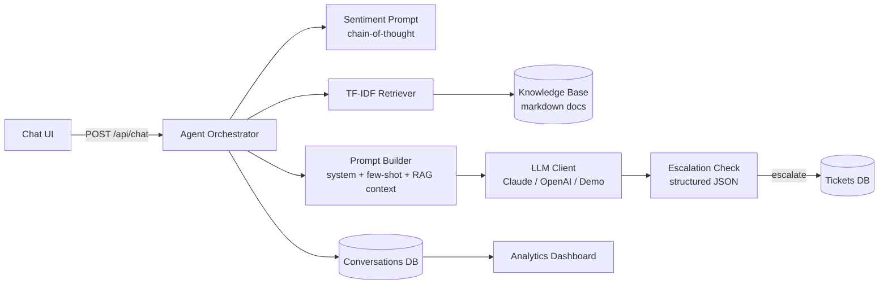

# PromptDesk — AI Customer Support Agent

An LLM-powered customer support system built around **prompt engineering**: layered system prompts, few-shot classification, chain-of-thought sentiment analysis, structured JSON outputs, and retrieval-augmented generation (RAG) — all wrapped in a FastAPI backend with a live chat UI, ticket escalation, and an analytics dashboard.

  

## Why this project

Most chatbots are a single API call. PromptDesk demonstrates the engineering that production support agents actually need:

| Capability | How it's done |
|---|---|
| **Grounded answers (RAG)** | TF-IDF retriever implemented *from scratch* (no ML libraries) ranks knowledge-base chunks; top passages are injected into the prompt with citation instructions |
| **Sentiment detection** | Chain-of-thought prompt classifies each message (positive/neutral/frustrated/angry) and the agent adapts tone dynamically |
| **Escalation & tickets** | A structured-output prompt decides when the bot can't help; a support ticket is created automatically in SQLite |
| **Conversation memory** | Full history stored per session and replayed into context |
| **Analytics** | Dashboard with message volume, sentiment breakdown, escalation rate |
| **Provider-agnostic** | Works with Anthropic Claude **or** OpenAI — plus a keyless demo mode so anyone can run it |

## Architecture



## Quick start

```bash
git clone https://github.com/<your-username>/promptdesk.git
cd promptdesk
python -m venv venv && source venv/bin/activate   # Windows: venv\Scripts\activate
pip install -r requirements.txt

# Option A: run with a real LLM
cp .env.example .env       # then add your ANTHROPIC_API_KEY or OPENAI_API_KEY

# Option B: no key? demo mode works out of the box (retrieval-only answers)
uvicorn app.main:app --reload
```

Open **http://localhost:8000** for the chat UI and **http://localhost:8000/dashboard** for analytics.

## Prompt engineering highlights

All prompts live in [`app/prompts.py`](app/prompts.py) — see [`docs/PROMPT_ENGINEERING.md`](docs/PROMPT_ENGINEERING.md) for the full write-up. Techniques used:

1. **Layered system prompt** — role, guardrails, tone rules, and output constraints are composed from separate blocks so each concern can be tested independently.
2. **Few-shot intent classification** — curated examples steer the model to consistent intent labels.
3. **Chain-of-thought sentiment analysis** — the model reasons before labeling, which measurably improves edge-case accuracy (sarcasm, mixed sentiment).
4. **Structured JSON outputs** — escalation decisions are forced into a strict schema and validated with Pydantic before any side effects run.
5. **Context injection with citations** — retrieved passages are wrapped in tagged blocks and the model is instructed to cite document titles, reducing hallucination.
6. **Dynamic tone adaptation** — the detected sentiment rewrites part of the system prompt for the answer generation call.

## Project structure

```
promptdesk/
├── app/
│   ├── main.py          # FastAPI routes
│   ├── agent.py         # Orchestrator: sentiment → RAG → answer → escalation
│   ├── prompts.py       # ★ The prompt library
│   ├── llm.py           # Claude / OpenAI / demo-mode client abstraction
│   ├── rag.py           # TF-IDF retriever built from scratch
│   ├── database.py      # SQLite: conversations, messages, tickets
│   ├── models.py        # Pydantic schemas
│   └── config.py        # Env-based settings
├── knowledge_base/      # Markdown docs the bot answers from
├── static/              # Chat UI + analytics dashboard
├── tests/               # pytest suite (runs without API keys)
└── docs/                # Prompt engineering write-up + setup guide
```

## Running tests

```bash
pytest
```

Tests cover the retriever, prompt construction, escalation parsing, and ticket creation — none require an API key.

## Sample knowledge base

Ships with docs for a fictional SaaS ("CloudCart"): billing, shipping, returns, and account management. Swap in your own markdown files under `knowledge_base/` — the retriever indexes them on startup.

## License

MIT — see [LICENSE](LICENSE).
